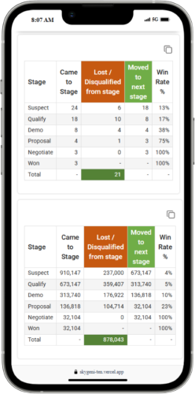
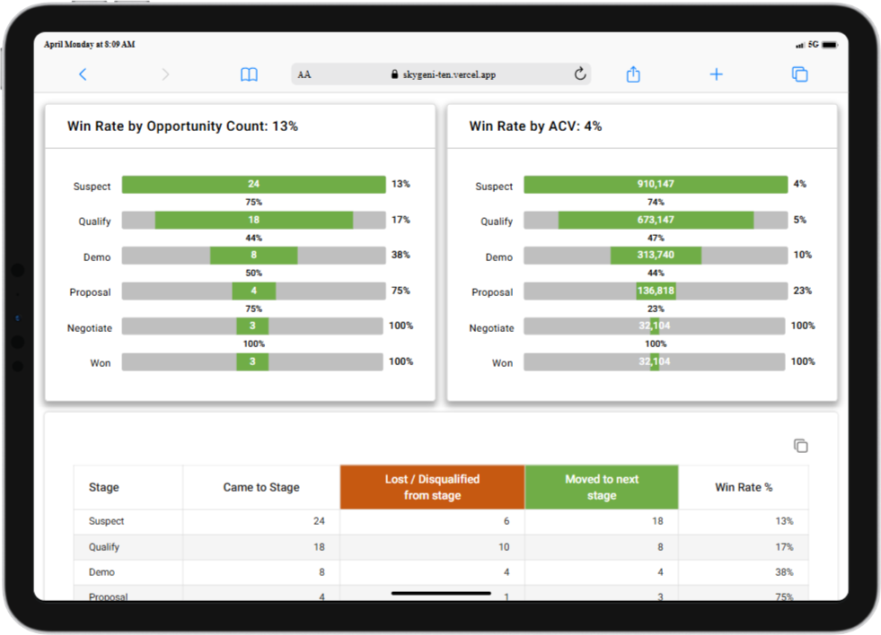

# Project Name: **Win Rate Dashboard**

This project visualizes and analyzes win rate data using charts and statistics. It fetches data from a backend API and displays it in a structured format, including bar charts and percentage statistics.

## 🔗 Live Demo

[Click here to view the live project](https://skygeni-ten.vercel.app/)

---

## Table of Contents

1. [Project Setup](#project-setup)
2. [Frontend Installation](#frontend-installation)
3. [Backend Installation](#backend-installation)
4. [Running the Project](#running-the-project)
5. [Technologies Used](#technologies-used)
6. [Device Screenshots](#device-screenshots)

---

## Project Setup

Before you begin, ensure you have the following installed for both the **frontend** and **backend**:

- **Node.js**: [Download Node.js](https://nodejs.org/)
- **npm** (comes with Node.js): For managing dependencies.
- **MongoDB** (for database)

---

## Frontend Installation

1. **Clone the repository:**

    ```bash
    git clone https://github.com/sanketyelugotla/skygeni
    cd Frontend
    ```

2. **Install dependencies:**
    Install the required dependencies by running the following command in the frontend directory:

    ```bash
    npm install
    ```

3. **Start the development server:**

    ```bash
    npm run dev
    ```

4. After the server starts, you can open the app in your browser at [http://localhost:5173](http://localhost:5173).

    - The project should automatically open in your default web browser.
    - If it does not, manually open the browser and go to [http://localhost:5173](http://localhost:5173).

---

## Backend Installation

1. **Clone the repository (Backend folder):**

    ```bash
    git clone https://github.com/sanketyelugotla/skygeni
    cd Backend
    ```

2. **Install dependencies:**
    Install the required dependencies by running the following command in the backend directory:

    ```bash
    npm install
    ```

3. **Set up the database:**
    - If using **MongoDB**, ensure the database is set up and running locally or use a cloud database provider like [MongoDB Atlas](https://www.mongodb.com/cloud/atlas).
    - Ensure the connection string is configured properly in the backend.

4. **Create a `.env` file:**
    - In the backend directory, create a `.env` file
    - Add the following variables:

    ```bash
    MONGO_URL=<your-mongodb-connection-string>
    PORT=5000
    ```

    - Replace `<your-mongodb-connection-string>` with your MongoDB URI. If using MongoDB Atlas, you can find this in your Atlas dashboard.
    - The `PORT` variable specifies the port on which the backend server will run (default is 5000).

5. **Run the backend server:**

    ```bash
    npm run dev
    ```

    This will start the backend server on [http://localhost:5000](http://localhost:5000) (or the port specified in your `.env` file).

---

## Running the Project

Once both the **frontend** and **backend** are running, follow these steps:

1. **Frontend:** Should be running on [http://localhost:5173](http://localhost:5173).
2. **Backend:** Should be running on [http://localhost:5000](http://localhost:5000) or the configured port.

The frontend will make API requests to the backend, fetch the data, and render it in charts and statistics.

---

## Technologies Used

### Frontend

- **React**: A JavaScript library for building user interfaces.
- **Redux**: A predictable state container for JavaScript apps.
- **Material-UI (MUI)**: A React UI framework for building modern UIs.
- **Styled Components**: For custom component styling.
- **Axios**: For making HTTP requests to the backend.

### Backend

- **Node.js**: JavaScript runtime for the backend.
- **Express.js**: Web framework for Node.js to handle routing and middleware.
- **MongoDB/Mongoose**: NoSQL database and ODM.
- **dotenv**: For managing environment variables.

---

## Device Screenshots

### Mobile Phones

|  |  |
| ------------------------------------------------------ | -------------------------------------------------------- |

### Laptops

|             |               |
| ----------------------------------------------------- | -------------------------------------------------------- |

### Tablets

|             |               |
| ----------------------------------------------------- | -------------------------------------------------------- |

### 4K Devices


